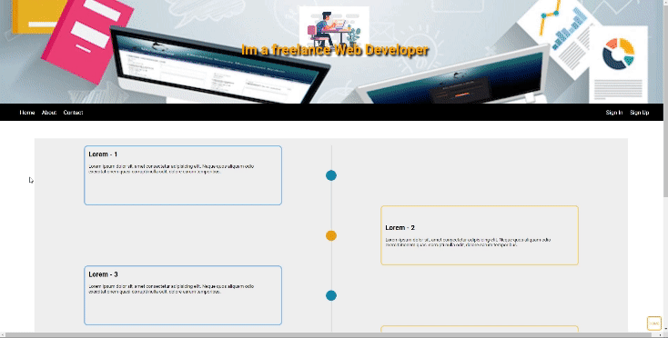

# Freelance Grid Layout
I completed this task as a part of my web development course at DCI (Digital Career Institute).

You can view my final result below or by [clicking here.](https://nik1703.github.io/freelance-grid-layout/)

## Task

Let's take advantage of positioning and Flexbox to recreate the reference image below -

### Keep in Mind

- The hero section at the top of the page should use the `header.jpg` image supplied in the `images` folder.
- Use semantic tags i.e. `<header>`, `<nav>` etc.
- The **HOME** button is always in the same position.
- `::before` and `::after` pseudo elements should be used to create the four dots in the main section ;)
- For the three cards at the bottom change their `z-index` on `:hover`

Good luck and have fun!
